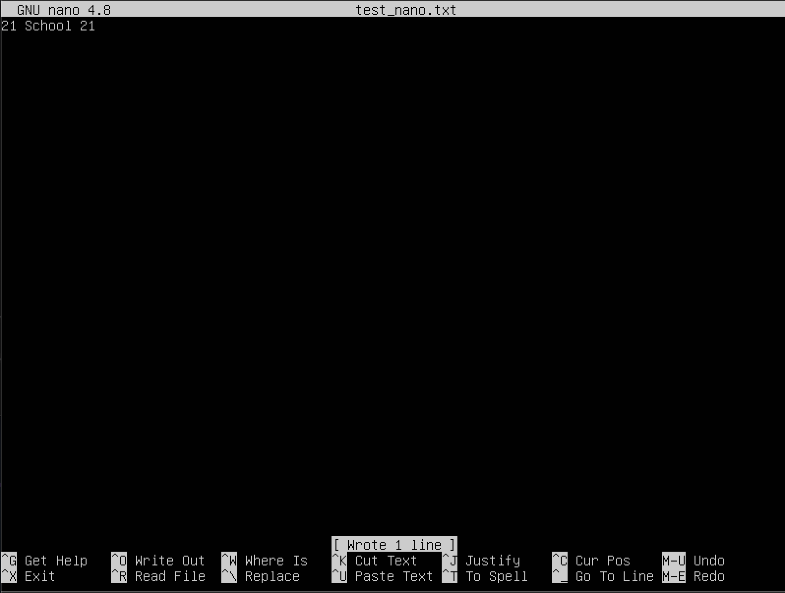
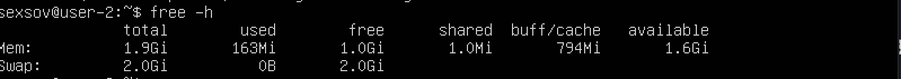
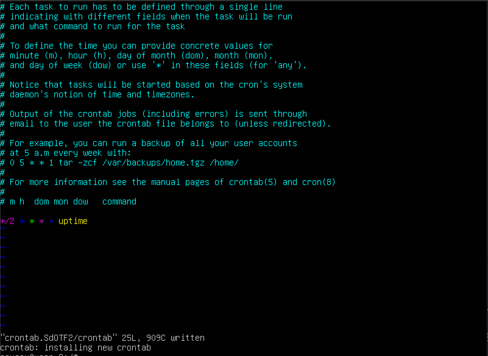

1 [Установка ОС](#part-1-установка-ос)  
    2 [Создание пользователя](#part-2-создание-пользователя)  
    3 [Настройка сети ОС](#part-3-настройка-сети-ос)   
    4 [Обновление ОС](#part-4-обновление-ос)  
    5 [Использование команды  sudo](#part-5-использование-команды-sudo)  
    6 [Установка и настройка службы времени](#part-6-установка-и-настройка-службы-времени)  
    7 [Установка и использование текстовых редакторов](#part-7-установка-и-использование-текстовых-редакторов)  
    8 [Установка и базовая настройка сервиса SSHD](#part-8-установка-и-базовая-настройка-сервиса-sshd)   
    9 [Установка и использование утилит top, htop](#part-9-установка-и-использование-утилит-top-htop)   
    10 [Использование утилиты fdisk](#part-10-использование-утилиты-fdisk)   
    11 [Использование утилиты df](#part-11-использование-утилиты-df)    
    12 [Использование утилиты du](#part-12-использование-утилиты-du)    
    13 [Установка и использование утилиты ncdu](#part-13-установка-и-использование-утилиты-ncdu)    
    14 [Работа с системными журналами](#part-14-работа-с-системными-журналами)     
    15 [Использование планировщика заданий CRON](#part-15-использование-планировщика-заданий-cron)

# Part 1. Установка ОС
## Проверка текущей версии Ubuntu

# Part 2. Создание пользователя
Создать пользователя, отличного от пользователя, который создавался при установке. Пользователь должен быть добавлен в группу adm. 

1.Команда добавления пользователя.

2.Проверка пользователя на добавления в группу adm.
 

# Part 3. Настройка сети ОС. 
## Задать название машины вида user-1.
 1.Для начала нам нужно узнать имя машины и для этого мы используем команду: hostnamectl

2.Чтобы изменить имя машине нам нужно будет выполнить два действия: 

2.1. Изменяем имя машины с помощью команды hostname set-hosname user-1 (имя пользователя)

2.2. Проверяем изменения с помощью команды hostnamectl status
  

## Установить временную зону, соответствующую вашему текущему местоположению.
1.Чтобы узнать, текущую временную зону, на котороую настроена система - вводим команду: timedatectl

2.Далее вводим команду: timedatectl list-timezones(выведется список всех доступных часоых поясов и ищем тот, который нам нужен)
3.Вводим команду: timedatectl set-timezone Europe/Moscow
 

## Вывести названия сетевых интерфейсов с помощью консольной команды.

1.Название сетевых интерфейсов можно узнать с помощью утилиты ifconfig(перед этим надо установить эту утилиту и вводим команду sudo apt install set-tools) Она выводит информацию о названии, состоянии, IP-адреса, МАС адреса и др.

2.В нашем случае утилита вывела 2 сетевых интерфейса. Первое - это сетевая карта интернета. Второе - lo(loopback) или локальная петля. Она используется для того, чтобы компьютер мог обращаться к самому себе и имеет по умолчанию ip-адрес 127.0.0.1 на всех компьютерах.
 

## Используя консольную команду получить ip адрес устройства, на котором вы работаете, от DHCP сервера.
### Использую команду: ip address можно узнать ip-адрес и многое другое.
 

DHCP - протокол, который служит для назначения IP-адреса клиенту. Работа этого протокола делится на 4 шага: Discovery(поиск) - изначально клиент находится в состоянии инициализации (init) и не имеет своего IP-адреса. Поэтому он отправляет широковещательное (broadcast) сообщение DHCPDISCOVER на все устройства в локальной сети. В той же локальной сети находится DHCP-сервер. Offer(предложение) - DHCP-сервер отвечает на поиск предложением, он сообщает IP, который может подойти клиенту. IP выделяются из области доступных адресов, которая задается администратором. DHCPOFFER содержит IP из доступной области, который предлагается клиенту отправкой сообщения. При этом, поскольку нужный клиент пока не имеет IP, для отправки прямого сообщения он идентифицируется по MAC-адресу. Request(запрос) - клиент получает DHCPOFFER, а затем отправляет на сервер сообщение DHCPREQUEST. Этим сообщением он принимает предлагаемый адрес и уведомляет DHCP-сервер об этом. Сообщение почти полностью дублирует DHCPDISCOVER, но содержит в себе уникальный IP, выделенный сервером. Acknowledgement(подтверждение) - сервер получает от клиента DHCPREQUEST и окончательно подтверждает передачу IP-адреса клиенту сообщением DHCPACK. Это сообщение утверждает не только владельца IP, но и срок, в течение которого клиент может использовать этот адрес.
## Определить и вывести на экран внешний ip-адрес шлюза (ip) и внутренний IP-адрес шлюза, он же ip-адрес по умолчанию (gw).
1. С помощью команды: ip rout на терминал выводится информация и мы обращаем внимание на строчку, которая начинается со слова default. После этого слова идут данные о внешнем ip-адреса шлюза(он же маршрутизатор).

## Задать статичные (заданные вручную, а не полученные от DHCP сервера) настройки ip, gw, dns (использовать публичный DNS серверы, например 1.1.1.1 или 8.8.8.8).
1.Для того, чтобы задать статичный ip-адрес, мы используем Netplan в качестве инструмента для упралвения сетью. Файлы конфигурации Netplan записываются в синтаксисе Yaml. Netplan сам сгенерирует необходимые файлы конфигурации. Чтобы назначить статический IP-адрес интерфейсу enp0s3, заходим в /etc/netplan, открываем файл и редактируем, как показано на скриншоте:

ВАЖНО: при редактировании файлов YAML надо убедиться, что следуете стандартам отступа кода YAML. Если синтаксис неправильный, изменения не будут применены.

Далее, мы сохраняем файл и запускаем команду: sudo netplan try, sudo netplan apply и проверяем изменения командой: ip addr. Для того, чтобы проверить DNS-сервер нужно выполнить команду: systemd-resolve --status 

### Перезагрузить виртуальную машину. Убедиться, что статичные сетевые настройки (ip, gw, dns) соответствуют заданным в предыдущем пункте.
С помощью команды: reboot перезагружаем виртуальную машину. Все прошлые настройки были сохраненны. Далее с помощью команды ping мы пингуем 1.1.1.1 и ya.ru

# Part 4. Обновление ОС

## Обновить системные пакеты до последней на момент выполнения задания версии.
С помощью команды: sudo apt-get upgrade обновляем ОС до последней версии.

# Part 5. Использование команды sudo

## Разрешить пользователю, созданному в Part 2, выполнять команду sudo.
1. Команда sudo позволяет строго определенным пользователям выполнять указанные программы с административными привилегиями без ввода пароля суперпользователя root. Таким образом, использование sudo позволяет выполнять привилегированные команды обычным пользователям без необходимости ввода пароля суперпользователя root. Список пользователей и перечень их прав по отношению к ресурсам системы может быть настроен оптимальным образом для обеспечения комфортной и безопасной работы. Например, команда sudo в Ubuntu Linux, используется в режиме, позволяющем выполнять любые задачи администрирования системы без интерактивного входа под учетной записью root.
2. C помощью команды: sudo usermod -a -G sudo me - мы добавляем пользователя в группу sudo для того, чтобы этот пользователь имел право использовать эту команду. Далее мы проверили, что пользователь добавлен в группу sudo

3. Переходим на другого пользователя, созданного во 2 части с помощью команды su - me. Узнаем hostname c помощью команды hostnamectl.

4. C помощью команды sudo мы открываем файл /etc/hostname и в первой строчке пишем новое имя. Файл откроется и вводим i, чтобы войти в режим изменения файла. После изменений обязательно сохраняем файл и выходим. Делаем это с помощью команды (:wq)
5.Вводим команду: sudo vim /etc/hosts и в открывшемся файле ищем строчку со старым именем и меняем его на новое. Файл откроется в режиме чтения, входим в режим изенения файла(i). После изменений обязательно сохраняем файл и выходим. Делаем это с помощью команды (:wq)

6. Далее я перезапустила систему и с помощью команды: hostnamectl мы видим, что имя изменилось

# Part 6. Установка и настройка службы времени

1. чтобы вывести текущее время, воспользуемся командой `timedatectl`
2. Выводим команду: timedatectl status и видим, что у нас не синхронизированы часы. Чтобы синхронизировать часы нам нужно установить NTP - протокол синхронизации времени по сети. Для установки вводим команду: sudo apt install ntp и далее мы заходим через: vim/nano в /etc/ntp.conf и мы видим, что там используют для синхронизации сервера Ubuntu. Для точности в ручную переписываем вместо Ubuntu пишем ru.
  3. Далее вводим команду: NTPSynchronized=yes: timedatectl show и видим результат на скриншоте.
  

# Part 7. Установка и использование текстовых редакторов
## Установить текстовые редакторы VIM (+ любые два по желанию NANO, MCEDIT, JOE и т.д.)

### Используя каждый из трех выбранных редакторов, создайте файл test_X.txt, где X -- название редактора, в котором создан файл. Напишите в нём свой никнейм, закройте файл с сохранением изменений.
1. Открываем файл с помощью текстового редактора vim test_vim.txt, жмем клавишу i(она позволит вносить изменения), печатаем нужный текст, нажимем esc, и для того, чтобы сохранить файл и выйти вводим команду :wq

2. Открываем файл с помощью текстового редактора nano test_nano.txt, печатаем нужный текст и для того, чтобы сохранить изменения в файле вводим комбинацию ctrl+o(регистр не важен), для выхода из файла вводим комбинацию ctrl+x

3.Cоздаем файл с помощью команды `mcedit test_mcedit.txt`. Пишем ник. Для выхода с сохранением нажимаем `Esc`, а затем клавишу `YES`

### Используя каждый из трех выбранных редакторов, откройте файл на редактирование, отредактируйте файл, заменив никнейм на строку "21 School 21", закройте файл без сохранения изменений.

1. Открываем файл с помощью текстового редактора vim test_vim.txt, печатаем нужный текст, для того, чтобы найти слово и изменить его мы переходим в обычный режим(esc) и вбиваем команду :%s/School/Linux/, где команда :s поиск и замена слов, % - означает, что мы будем изменять во всем файле, School - слово, которое ищем, Linux - на какое слово мы хотим поменять.

Открываем файл с помощью текстового редактора nano test_nano.txt, печатаем нужный текст, для того, чтобы найти слово и изменить его мы нажимаем Ctrl+, вводим слвов, которое необходимо искать и нажимаем клавишу Enter. Затем вводим слово, на которое производим замену и нажимаем Enter. После этого появится предложение по замене первого вхождения вашей строки. Мы нажимаем Y(yes).

Открываем файл с помощью команды `mcedit test_mcedit.txt`. Для поиска в mcedit вводим `F7`, затем вводим слово, которое хотим найти, оно выделяется зеленым.
Для замены слова в mcedit жмем `F4`, затем вводим "almaveno", нажимаем стрелку вниз, пишем "21 School 21"

# Part 8. Установка и базовая настройка сервиса SSHD

## Установить службу SSHd
1.Для установки ssh вводим команду: sudo apt-get install ssh
2.Устанавливаем openSSH: sudo apt install openssh-server
3.И проверяем работу ssh-сервера: systemctl status sshd

## Добавить автостарт службы при загрузке системы
Добавляем пакет ssh-сервера в автозагрузку: sudo systemctl enable sshd

## Перенастроить службу SSHd на порт 2022.
1. Меняем порт в конфигурационном файле SSH сервера, воспользоваться можно любым текстовым редактором: sudo vim /etc/ssh/sshd_config
2. Ищем строку: Port 22. Если строка начинается с символа #, его нужно удалить и вместо 22 порта, написать любой другой, например 2022.
3. Если вы допустили какую-либо ошибку в конфигурационном файле, то вы можете потерять связь с сервером. Будьте осторожны. Запускаем рестарт ssh-сервера: /etc/init.d/ssh restart
4. И проверяем: sudo netstat -tulpan | grep ssh

## Используя команду ps, показать наличие процесса sshd. Для этого к команде нужно подобрать ключи.
1. Для нахождения информации о процеесе sshd - мы используем команду: ps -fL -C sshd. Команда ps - показывает состояние процессов. Флаг -f выводит максимум доступных данных, например, количество потоков. Флаг -L отображает потоки процессов в колонках LWP(легковесный процесс) и NLWP(число легковесных процессов). Флаг -С выбирает процессы по имени команды.

2. UID - идентификатор пользователя. PID - каждый процесс в операционной системе имеет свой уникальный идентификатор, по которому можно получить информацию об этом процессе, а также отправить ему управляющий сигнал или завершить. PPID - это идентификатор родительского процесса по отношению к текущему процессу в операционной системе Linux. LWP - легковесный процесс. C - процент времени CPU, используемого процессом; NLWP - число легковесных процессов. STIME - время запуска процесса. TTY - терминал, из которого запущен процесс. TIME - общее время процессора, затраченное на выполнение процессора. CMD - команда запуска процессора

## Перезагрузить систему.
1.Вводим команду: netstat -tan

2. netstat - показывает содержимое различных структур данных, связанных с сетью, в различных форматах в зависимости от указанных опций. -tan: вывод всех активных подключений TCP и прослушиваемых компьютером портов TCP и UDP + показывает сетевые адреса как числа. netstat обычно показывает адреса как символы. Эту опцию можно использовать с любым форматом показа.

State: Listen - ожидает входящих соединений. Proto: протокол, используемый сокетом. Recv-Q: количество байтов, не скопированных пользовательской программой, подключенной к этому сокету. Send-Q: количество неподтвержденных байтов удаленного хоста. Local address: локальный адрес (имя локального хоста) и номер порта сокета. Foreign address: удаленный адрес (имя удаленного хоста) и номер порта сокета. 0.0.0.0 - это немаршрутизируемый адрес IPv4, который можно использовать в разных целях, в основном, в качестве адреса по умолчанию или адреса-заполнителя. Несмотря на то, что адрес 0.0.0.0 может использоваться в компьютерных сетях, он не является адресом какого-либо устройства.

# Part 9. Установка и использование утилит top, htop

## Установить и запустить утилиты top и htop.
1.Для установки утилиты top понадобится команда: sudo apt install top
2.Uptime - перезагрузка была сделана 3 мин назад
3.Количество авторизованных пользователей - 1 user
4.Общая загрузка системы - load average(0.06, 0.16, 0.08)
5.Общее количество процессов - 99 total
6.Загрузка cpu - это статистика загрузки процессора(3 строчка) us — процент использования центрального процессора пользовательскими процессам sy — процент использования центрального процессора системными процессами ni — процент использования центрального процессора процессами с приоритетом, повышенным при помощи вызова id — процент времени, когда центральный процессор не используется wa — процент использования центрального процессора процессами, ожидающими завершения операций ввода-вывода hi - Hardware IRQ (аппаратные прерывания) — процент использования центрального процессора обработчиками аппаратных прерываний si - Software Interrupts (программные прерывания) — процент использования центрального процессора обработчиками программных прерываний st - Steal Time (заимствованное время) — количество ресурсов центрального процессора "заимствованных" у виртуальной машины гипервизором для других задач (таких, как запуск другой виртуальной машины); это значение будет равно нулю на настольных компьютерах и серверах, не использующих виртуальные машины.
7.Загрузка памяти - В четвертой и пятой строке(на скриноте) выводится информация об использовании физической оперативной памяти и раздела подкачки соответственно (swap). Значения в порядке следования: общее количество памяти (total), количество используемой памяти (used), количество свободной памяти (free), количество памяти в кэше буферов (buffers).
8.Рid процесса занимающего больше всего памяти - это root. VIRT — виртуальная память, которую использует процесс(102576) RES — физическая память, занятая данным процессом(11444)
9.Pid процесса, занимающего больше всего процессорного времени - %CPU — процент использования процессорного времени;

10. Вводим команду htop, чтобы отсортировать нажимаем f6 и выбираем в появившейся табличке справа, по какму параметру нам нужно отсортировать.

PID 

PERCENT_CPU

PERCENT_MEM

# Part 10. Использование утилиты fdisk
## Запустить команду fdisk -l.

1.Название жесткого диска /dev/sda
2.Память 10 гб(10737418240 байта)
3.20971520 секторов
4.У меня нет раздела подкачки, поэтому swap тут нет

# Part 11. Использование утилиты df

## Запустить команду df.
1.размер раздела - 2.0 G размер занятого пространства - 108 мб размер свободного пространства - 1,7 G процент использования - 6%
2.единицу измерения в выводе - Mb

# Part 12. Использование утилиты du
## Запустить команду du.
### Вывести размер папок /home, /var, /var/log (в байтах, в человекочитаемом виде)
1. Запускаем команду du -h(выводит общий размер папок в байтах)

/home

/var 

/var/log

## Вывести размер всего содержимого в /var/log (не общее, а каждого вложенного элемента, используя *)

Команда du -ha /var/log/* показывает размер всего содержимого

# Part 13. Установка и использование утилиты ncdu

## Установить утилиту ncdu.

1. Команда: sudo apt-get install ncdu

## Вывести размер папок /home, /var, /var/log.

2. ncdu /home, /var, /var/log

# Part 14. Работа с системными журналами

## Открыть для просмотра:
1. /var/log/dmesg
2. /var/log/syslog
3. /var/log/auth.log

Перезапускаем ssh с помощью команды: /etc/init.d/ssh restart. В /var/log/syslog отображается эта информация

# Part 15. Использование планировщика заданий CRON

## Используя планировщик заданий, запустите команду uptime через каждые 2 минуты.

1. Для запуска cron нужно установить его командой: sudo apt install cron. Далее командой: crontab -e создается файл, где нам предлагают выбрать текстовый редактор на ваш выбор, в дальнейшем будет использоваться именно он. Прописываем в файле */2 * * * * uptime, сохраняем и закрываем файл.

2. Командой: crontab -l показываем список текущих задач

## Удалите все задания из планировщика заданий.
Команда: crontab -r удаляет все задачи из cron и командой: crontab -l проверяем, что нет никаких текущих задач
